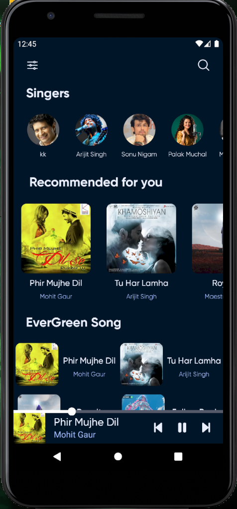

# MusiK 🎵

MusiK is a React Native music player application that allows users to play, pause, shuffle, and control music tracks with ease. The app is built using `react-native-track-player` for seamless audio playback and provides a rich user experience with robust audio playback capabilities, supporting a range of user interactions and custom controls.

## Features

- **Floating Player**: Integrates a dynamic floating player that displays the current track's album art, title, and artist name. Users can control playback directly from this interface, with buttons for play/pause, skipping to the next track, and returning to the previous track.
- **Shuffle Functionality**: Enables users to shuffle the current playlist with a single tap.
- **Seek Slider**: A precise and responsive seek slider that allows users to scrub through the track. The slider updates in real-time, reflecting the current playback position and enabling users to easily navigate through a song.
- **Responsive Design**: Adapts to different screen sizes and orientations for an optimal user experience.

## Installation

1. Clone the repository:
   ```bash
   git clone https://github.com/Shekhar-roy-5292/MusiK.git
2. Install the dependencies:
   ```bash
   npm install
3. Link the necessary native modules:
   ```bash
   npx react-native link
4. Start the Metro server:
   ```bash
   npx react-native start
5. Run the app:
     1. For iOS:
        ```bash
        npx react-native run-ios
     1. For Android:
        ```bash
        npx react-native run-android

## Usage

- **Floating Player**: Displays the album art, song title, and artist name. It includes controls for play/pause, next, and previous tracks.
- **Shuffle Toggle**: Tap the shuffle icon to shuffle the current playlist.
- **Seek Slider**: Drag the slider to seek through the track.


## Screen shots


<div class="responsive-grid">
  <!-- Image 1 with title -->
  <div class="grid-item">
    
    <p>Home Screen</p>
  </div>

  <!-- Image 2 with title -->
  <div class="grid-item">
    
    <p>Drawer screen</p>
  </div>

  <!-- Image 3 with title -->
  <div class="grid-item">
    
    <p>Player Screen</p>
  </div>

  <!-- Image 4 with title -->
  <div class="grid-item">
    
    <p>Liked Son</p>
  </div>
</div>


